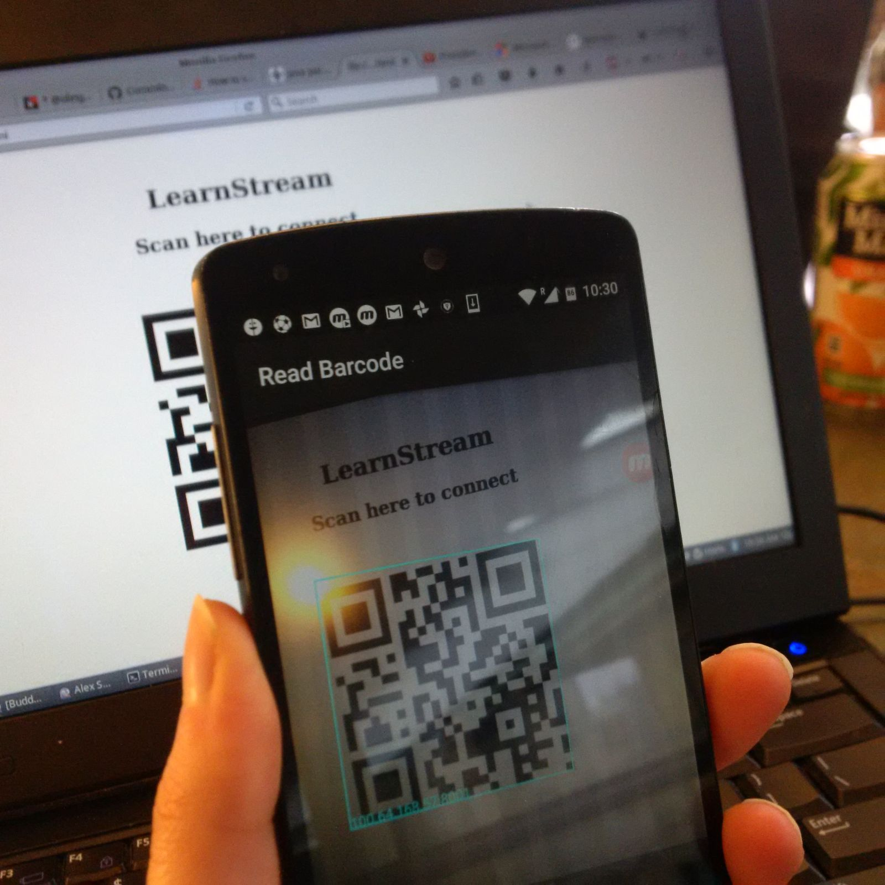
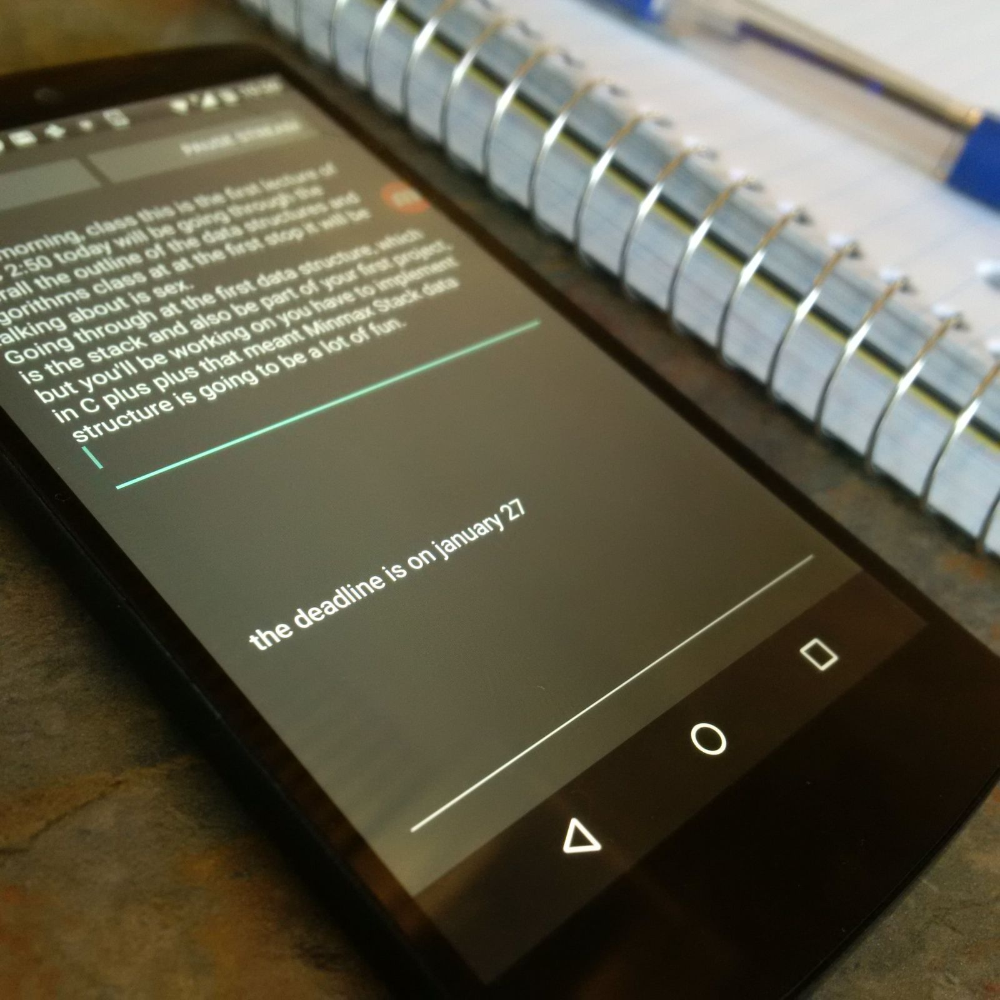

# Learn Stream

## What is LearnStream

LearnStream is a mobile application for students with hearing impairments or language comprehension difficulties, that helps them follow lectures at University.

## The problem

Students who are hard-of-hearing often have a hard time hearing and understanding the professor during lectures, even when sitting in the front row or in a room equipped with a microphone and speakers. Many universities provide sign language assistants, but requiring an assistant does not allow students the flexibility to attend alternate lecture sessions on short notice or allow them to sit in extra courses. Furthermore, students with borderline or more temporary hearing loss may be denied assistance altogether.

For many more students, the difficulties of understanding lectures are magnified by the fact that they are new English speakers. Often, students’ oral comprehension falls behind their reading ability, and some words may be new or difficult to understand, or spoken quickly.

## How it works

Our idea is simple: using the microphone of a smartphone or a Laptop, the voice of the lecturer is streamed in realtime (through the local WiFi network of the University) to the smartphone of students who need it. Students can adjust the volume and frequency of the audio stream to a level that they find comfortable.

Moreover, using the Speech-To-Text Microsoft API (Cognitive Bing speech API), LearnStream is able to display a real-time transcript of the lecture. Thanks to the quality of the Bing-Speech API, the speech-to-text transcription is done with unnoticeable lag.

Connecting from a student’s phone to the teacher’s computer is easy. Launching LearnStream on the teacher’s computer displays a unique QR code identifier, which may be scanned by students to instantly connect.

## Demo

To connect to the streaming media, the students scan a QR code.

The speech-to-text features allows students to have a real-time transcript of the lecture.

## Suggestions

We greatly appreciate any suggestion or comment :)

## Thank you UofTHacks

We would like to thanks the organizers for organizing UofTHacks IV! You did a great job!
